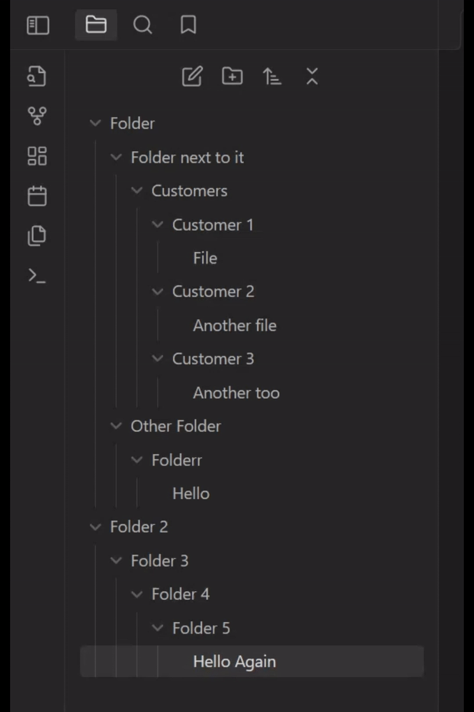

# Auto Folder Collapse

A plugin for [Obsidian](https://obsidian.md) that automatically collapses all child folders when you collapse a parent folder. This helps keep your file explorer organized and clutter-free.

## Installation

### Downloading from the obsidian.md Community Plugin Browser

1. Open Obsidian and go to `Settings`.
2. Navigate to the `Community plugins` section.
3. Click on `Browse` and search for `Auto Folder Collapse`.
4. Click `Install` and then `Enable`.

### Dwonloading from the GitHub Repository

1. Download the plugin files from the [GitHub repository](https://github.com/DarioCasciato).
2. Copy the Plugin Folder to your Obsidian vault's plugins folder: `<vault>/.obsidian/plugins/`.
3. Enable the plugin in Obsidian:
   - Open Obsidian and go to `Settings`.
   - Navigate to the `Community plugins` section.
   - Refresh the Community Plugin list.
   - Enable the new Plugin.

## Demo

## Usage

Once the plugin is enabled, it will automatically collapse all child folders when you collapse a parent folder. You don't need to do anything else!

**Note**: In some cases, the plugin stops working. To resolve the problem, call the `Reload Collapse Subfolders Plugin` command in the obsidian CLI.

## Troubleshooting

If you encounter any issues with the plugin, try the following steps:

1. Ensure you are using the minimum required version of Obsidian (`0.12.0`).
2. Disable and re-enable the plugin in the Obsidian settings.
3. Restart Obsidian.

If the problem persists, please report it on the [GitHub Issues page](https://github.com/DarioCasciato/obsidian-auto-folder-collapse/issues).

## Author

Developed by [Dario Casciato](https://github.com/DarioCasciato).

## License

This plugin is licensed under the [MIT License](https://github.com/DarioCasciato/obsidian-auto-folder-collapse/blob/main/LICENSE).
